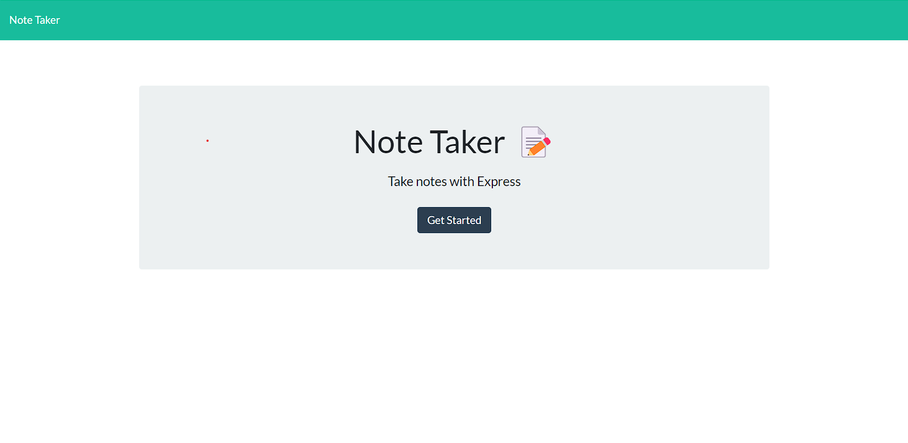

# Note Taker using Express.js

## Description
This application uses Node.js and Express.js to write and save notes. Express.js is used to save and retrieve note data.

## Prerequisites
In order to work on this project make sure to have node and express installed. The code editor I am using for this project is VSCode.

## Screenshots

## Usage
Click on "Get Started" to be taken to the notes page.

Save a new note by inputing text in the title and text area. Then use the save button near the top right to the left of the plus button to save your note.
Delete a previous note by clicking on the red trash can icon.

## Deployment
[Heroku](https://express-note-taking-app.herokuapp.com/)
## Contact
[GitHub](https://github.com/charles-ram/m11-express)